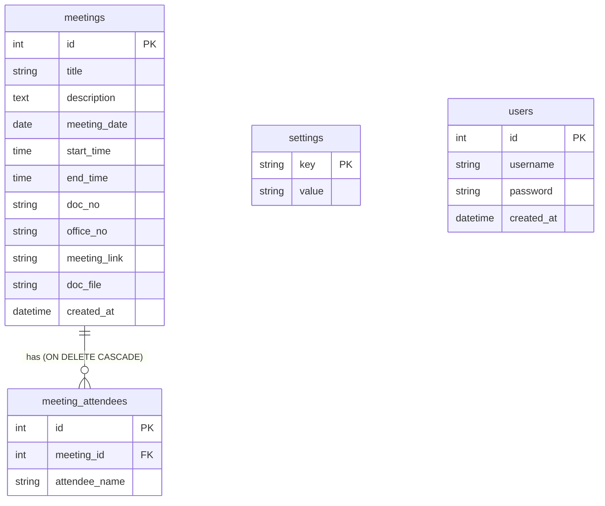

# MeetFlow Developer Documentation (ARCHITECTURE & HANDOFF)

This document is intended for AI developers and engineers to understand the system architecture, database design, files layout, and implementation guidelines of MeetFlow.

---

## 1. System Overview & Tech Stack
MeetFlow is a monthly calendar application for scheduling meetings and training sessions, built to run on Windows Server IIS with PHP and MySQL. It also features automatic Local Fallback to SQLite to allow developers to build, test, and debug on local machines without configuring a local MySQL instance.

- **Backend**: PHP (8.0 - 8.4+)
- **Database**: 
  - **Production**: MySQL/MariaDB
  - **Local testing**: SQLite (automatic connection fallback)
- **Frontend**: Vanilla CSS Grid & CSS Flexbox (Dark Glassmorphic design). Fully responsive for both desktop and mobile screens.
- **External Integrations**:
  - **Discord Webhooks**: Real-time notifications on creation, modification, and deletion.
  - **Daily Summary**: Cron/Task Scheduler daily summaries sent to Discord.
  - **LINE LIFF**: Mobile-first search interface optimized for LINE app webview.

---

## 2. File Directory & Component Mapping

| File Path | Description / Component Responsibility |
| :--- | :--- |
| `db.php` | **Database Connector**: Automatically tries connecting to MySQL via PDO. If it fails, falls back to local `meetflow.sqlite` file. Automatically executes tables creation and default seeds on fallback initialization. |
| `schema.sql` | **Database Schema**: SQL script containing tables structures, relationship constraints (`ON DELETE CASCADE`), indexes, and default seeds for production MySQL. |
| `index.php` | **Home Page (Monthly Calendar)**: Features responsive CSS grid layout, interactive day cards, and action dialog modals. Displays add/edit options for Admins, and view-only details for guests. |
| `style.css` | **Central CSS Styling**: Governs themes, typography, custom scrollbars, glassmorphic card containers, and mobile responsiveness media queries (e.g., changes calendar structure to linear cards below 768px). |
| `liff.php` | **LINE LIFF Search Page**: Mobile-first search UI querying database by document number or office receipt number. Includes collapsible cards, direct download links, and direct copy buttons for meeting URLs. |
| `report.php` | **Printable Reports**: Offers date-range filtering and type selection. Integrated with `@media print` CSS configurations to hide non-table actions and style data into a professional document table for printing. |
| `settings.php` | **Configuration Panel (Admin)**: Allows updating Discord Webhook URL, toggle notification preferences, specifying daily notification dispatch hour/minute, and changing admin password. |
| `users.php` | **User Administration**: UI for creating new admin credentials (passwords hashed with `password_hash` via Bcrypt) and deleting existing accounts (with self-deletion protection). |
| `notify_discord.php` | **Discord Dispatcher**: Houses functions to execute POST requests to Discord Webhook with embedded payloads, rich colors (green for add, orange for edit, red for delete), and structured details. |
| `cron_notify.php` | **Daily Reminder Job**: Executed periodically by Task Scheduler. Queries today's scheduled meetings, checks database settings to see if notifications are enabled and if the designated time has arrived, sends a Discord embed summary, and logs `last_cron_run_date` to prevent duplicate dispatches. |
| `login.php` / `logout.php` | **Authentication handlers**: Manages administrative sessions. |
| `save_meeting.php` | **Meeting Save Endpoint**: Validates, saves, or edits meeting records. Handles file upload securely. |
| `delete_meeting.php` | **Meeting Deletion Endpoint**: Triggers database record deletion. |
| `get_meeting.php` | **Details API**: Endpoint returning JSON representations of a specific meeting for editing. |
| `uploads/` | **Uploaded Documents folder**: Storage for PDF/doc attachments. |
| `uploads/.htaccess` | **Apache Security**: Disables PHP/script execution within the uploads folder to prevent Remote Code Execution (RCE). |
| `uploads/web.config` | **IIS Security**: Disables handlers/scripts execution inside IIS environments. |

---

## 3. Database Schema Design
The system uses two tables. Relational integrity is enforced using foreign keys with cascade delete triggers.



- **Indexes**: Added on `meetings(meeting_date)` for fast calendar monthly query, and composite index on `meetings(doc_no, office_no)` to accelerate search speeds within LINE LIFF queries.
- **All-day Events Convention**: All-day meetings (ตลอดทั้งวัน) are stored in the database with `start_time = '00:00:00'` and `end_time = '23:59:00'`. The frontend layouts (calendar cells, details modal, LINE LIFF cards, and PDF reports) identify this pattern and display the text `"ตลอดทั้งวัน"` in place of the time range.

---

## 4. Key Security Implementations
1. **Password Hashing**: Admin passwords are saved using PHP's native secure password library (`password_hash(..., PASSWORD_DEFAULT)`).
2. **SQL Injection Prevention**: All SQL statements are processed using PDO Prepared Statements.
3. **Uploads Folder Protection (RCE prevention)**:
   - `web.config` blocks execution handlers:
     ```xml
     <handlers><clear /><add name="StaticFile" path="*" verb="*" modules="StaticFileModule,DirectoryListingModule" resourceType="Either" /></handlers>
     ```
   - `.htaccess` overrides engine settings:
     ```apache
     php_flag engine off
     Options -ExecCGI
     ```

---

## 5. Deployment Checklist for AI & Engineers
When transferring this codebase to production:
1. Setup MySQL database with `schema.sql`.
2. Configure DSN details inside `db.php` (set to production IP/credentials).
3. Assign IIS AppPool read/write/modify permissions to the `uploads/` folder.
4. Set up Task Scheduler/Cron trigger targeting `cron_notify.php` (e.g. running every 10 minutes).
5. Bind LIFF APP in LINE Developer console pointing to `liff.php` and configure ID inside `liff.php`.
