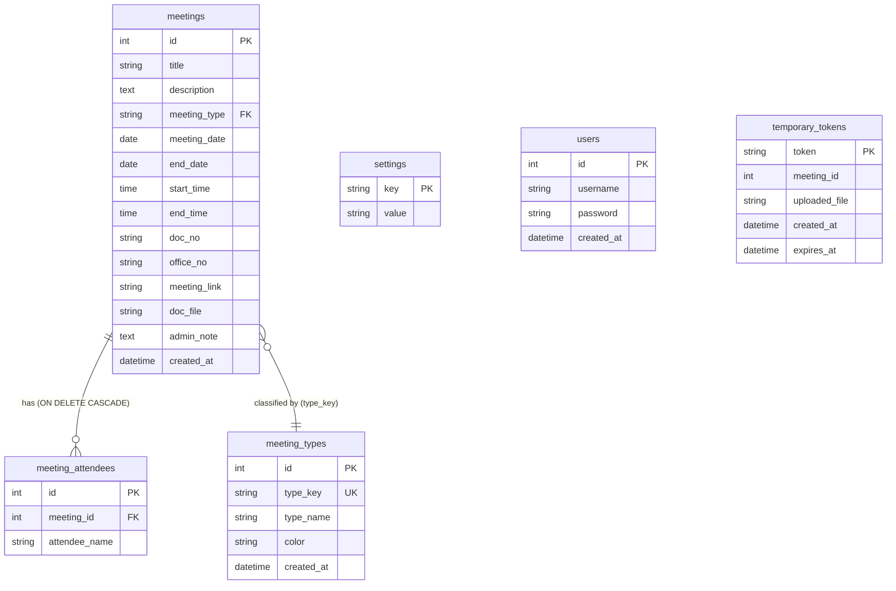

# MeetFlow Developer Documentation (ARCHITECTURE & HANDOFF)

This document is intended for AI developers and engineers to understand the system architecture, database design, files layout, and implementation guidelines of MeetFlow.

---

## 1. System Overview & Tech Stack
MeetFlow is a monthly calendar application for scheduling meetings and training sessions, built to run on Windows Server IIS with PHP and MySQL. It also features automatic Local Fallback to SQLite to allow developers to build, test, and debug on local machines without configuring a local MySQL instance.

- **Backend**: PHP (8.0 - 8.4+)
- **Database**: 
  - **Production**: MySQL/MariaDB
  - **Local testing**: SQLite (automatic connection fallback)
- **Frontend**: Vanilla CSS Grid & CSS Flexbox (Dark Glassmorphic design). Fully responsive for both desktop and mobile screens.
- **External Integrations**:
  - **Discord Webhooks**: Real-time notifications on creation, modification, and deletion.
  - **Daily Summary**: Cron/Task Scheduler daily summaries sent to Discord.
  - **LINE LIFF**: Mobile-first search interface optimized for LINE app webview.

---

## 2. File Directory & Component Mapping

| File Path | Description / Component Responsibility |
| :--- | :--- |
| `db.php` | **Database Connector**: Automatically tries connecting to MySQL via PDO. If it fails, falls back to local `meetflow.sqlite` file. Automatically executes tables creation and default seeds on fallback initialization. |
| `schema.sql` | **Database Schema**: SQL script containing tables structures, relationship constraints (`ON DELETE CASCADE`), indexes, and default seeds for production MySQL. |
| `index.php` | **Home Page (Monthly Calendar)**: Features responsive CSS grid layout, interactive day cards, and action dialog modals. Displays add/edit options for Admins, and view-only details for guests. |
| `style.css` | **Central CSS Styling**: Governs themes, typography, custom scrollbars, glassmorphic card containers, and mobile responsiveness media queries (e.g., changes calendar structure to linear cards below 768px). |
| `liff.php` | **LINE LIFF Search Page**: Mobile-first search UI querying database by document number or office receipt number. Includes collapsible cards, direct download links, and direct copy buttons for meeting URLs. |
| `list.php` | **Tabbed Meeting List**: Offers date-range filtering, keyword search, and type selection. Divides meetings into *Today* (วันนี้), *Upcoming* (เร็วๆ นี้), and *Past* (ผ่านไปแล้ว) tabs. Provides inline Edit and Delete options for admins and print-formatted layout for printing. |
| `settings.php` | **Configuration Panel (Admin)**: Allows updating Discord Webhook URL, toggle notification preferences, specifying daily notification dispatch hour/minute, and changing admin password. |
| `users.php` | **User Administration**: UI for creating new admin credentials (passwords hashed with `password_hash` via Bcrypt) and deleting existing accounts (with self-deletion protection). |
| `notify_discord.php` | **Discord Dispatcher**: Houses functions to execute POST requests to Discord Webhook with embedded payloads, rich colors (green for add, orange for edit, red for delete), and structured details. |
| `cron_notify.php` | **Daily Reminder Job**: Executed periodically by Task Scheduler. Queries today's scheduled meetings, checks database settings to see if notifications are enabled and if the designated time has arrived, sends a Discord embed summary, and logs `last_cron_run_date` to prevent duplicate dispatches. |
| `login.php` / `logout.php` | **Authentication handlers**: Manages administrative sessions. |
| `save_meeting.php` | **Meeting Save Endpoint**: Validates, saves, or edits meeting records. Handles file upload securely. |
| `delete_meeting.php` | **Meeting Deletion Endpoint**: Triggers database record deletion. |
| `get_meeting.php` | **Details API**: Endpoint returning JSON representations of a specific meeting for editing. |
| `migrate.php` | **Database Migration Helper**: Troubleshooting script to verify or alter MySQL/SQLite tables if columns are missing. Outputs raw SQL fallback suggestions if IIS/MySQL lacks ALTER permissions. |
| `meeting_types.php` | **Meeting Types Administration**: UI for creating new meeting types (with a custom label and HTML color picker), editing display names/colors, and deleting custom categories. |
| `uploads/` | **Uploaded Documents folder**: Storage for PDF/doc attachments. |
| `uploads/.htaccess` | **Apache Security**: Disables PHP/script execution within the uploads folder to prevent Remote Code Execution (RCE). |
| `uploads/web.config` | **IIS Security**: Disables execution of script extensions (.php, .asp, etc.) via safe request filtering. |

---

## 3. Database Schema Design
The system uses two tables. Relational integrity is enforced using foreign keys with cascade delete triggers.



### 3.1 Data Dictionary (พจนานุกรมข้อมูล)

#### 1) ตาราง `meetings` (ข้อมูลนัดประชุมและวันอบรม)
เก็บข้อมูลรายละเอียดการนัดประชุม ข้อมูลการเชื่อมโยง เลขที่หนังสือ และไฟล์แนบ

| Column Name | Data Type | Nullable | Key | Default | Description / Explanation |
| :--- | :--- | :--- | :--- | :--- | :--- |
| `id` | INT | NO | PK | Auto-Inc | รหัสประจำรายการการนัดหมาย |
| `title` | VARCHAR(255) | NO | | | หัวข้อการนัดหมายประชุมหรือวันอบรม |
| `description` | TEXT | YES | | NULL | รายละเอียดวาระประชุม หรือคำอธิบายเพิ่มเติม |
| `meeting_type` | VARCHAR(50) | NO | FK | 'meeting' | รหัสประเภทการนัดหมาย (เชื่อมโยงกับ `meeting_types.type_key`) |
| `meeting_date` | DATE | NO | Index | | วันที่เริ่มต้นนัดหมายประชุมหรือจัดอบรม (YYYY-MM-DD) |
| `end_date` | DATE | YES | | NULL | วันที่สิ้นสุดนัดหมาย สำหรับกรณีจัดกิจกรรมหลายวัน (หากเป็นวันเดียวจะมีค่าเท่ากับ meeting_date) |
| `start_time` | TIME | NO | | | เวลาเริ่มต้น |
| `end_time` | TIME | NO | | | เวลาสิ้นสุด |
| `doc_no` | VARCHAR(100) | YES | Index | NULL | เลขที่หนังสืออ้างอิงนำส่ง (เช่น นร 0505/...) |
| `office_no` | VARCHAR(100) | YES | Index | NULL | เลขรับสำนักงานอ้างอิงข้อมูล |
| `meeting_link` | VARCHAR(255) | YES | | NULL | ลิงก์ที่เกี่ยวข้องเพื่อเชื่อมโยง เช่น ลิงก์เข้าประชุม ลงทะเบียน หรือเอกสารประกอบการประชุมเพิ่มเติม |
| `doc_file` | VARCHAR(255) | YES | | NULL | ชื่อไฟล์เอกสารแนบที่บันทึกไว้ในโฟลเดอร์ `uploads/` |
| `admin_note` | TEXT | YES | | NULL | บันทึกส่วนตัวหรือหมายเหตุภายในเฉพาะผู้ดูแลระบบ (ความปลอดภัย: ข้อมูลส่วนนี้จะถูกกรองออกทันทีหากเรียกผ่าน API โดยไม่ล็อกอินแอดมิน) |
| `created_at` | TIMESTAMP | NO | | CURRENT_TIMESTAMP | วันเวลาที่สร้างข้อมูลเข้าระบบ |

#### 2) ตาราง `meeting_types` (ข้อมูลรหัสประเภทการนัดหมายแบบไดนามิก)
เก็บประเภทหมวดหมู่กิจกรรมและการระบุรหัสสีเพื่อใช้ในการแสดงผล Badge / แถบสี บนหน้าเว็บ

| Column Name | Data Type | Nullable | Key | Default | Description / Explanation |
| :--- | :--- | :--- | :--- | :--- | :--- |
| `id` | INT | NO | PK | Auto-Inc | รหัสประจำรายการประเภท |
| `type_key` | VARCHAR(50) | NO | UK | | คีย์รหัสกิจกรรมภาษาอังกฤษ (เช่น `meeting`, `training`, `seminar`) |
| `type_name` | VARCHAR(100) | NO | | | ชื่อประเภทการนัดหมายภาษาไทย (เช่น ประชุม, อบรม, สัมมนา) |
| `color` | VARCHAR(20) | YES | | '#3b82f6' | รหัสสีแสดงผลแบบ Hex (เช่น `#3b82f6`, `#e11d48`) |
| `created_at` | TIMESTAMP | NO | | CURRENT_TIMESTAMP | วันเวลาที่เพิ่มประเภทเข้าระบบ |

#### 3) ตาราง `meeting_attendees` (รายชื่อผู้เข้าร่วมการนัดหมาย)
เก็บรายชื่อผู้เข้าร่วมในแต่ละการประชุม (มีความสัมพันธ์แบบ One-to-Many กับ `meetings`)

| Column Name | Data Type | Nullable | Key | Default | Description / Explanation |
| :--- | :--- | :--- | :--- | :--- | :--- |
| `id` | INT | NO | PK | Auto-Inc | รหัสประจำรายการรายชื่อ |
| `meeting_id` | INT | NO | FK | | รหัสรายการนัดหมายที่เชื่อมโยง (มีข้อจำกัด `ON DELETE CASCADE`) |
| `attendee_name` | VARCHAR(100) | NO | | | ชื่อ-นามสกุล หรือตำแหน่งของผู้เข้าร่วมประชุม |
| `created_at` | TIMESTAMP | NO | | CURRENT_TIMESTAMP | วันเวลาที่บันทึกรายชื่อ |

#### 4) ตาราง `settings` (การตั้งค่าคอนฟิกระบบ)
เก็บค่ากำหนดต่างๆ เช่น Discord Webhook และช่วงเวลาแจ้งเตือนรายวัน

| Column Name | Data Type | Nullable | Key | Default | Description / Explanation |
| :--- | :--- | :--- | :--- | :--- | :--- |
| `setting_key` | VARCHAR(100) | NO | PK | | รหัสคีย์การตั้งค่า (เช่น `discord_webhook`, `notify_daily`) |
| `setting_value` | TEXT | YES | | NULL | ค่าคอนฟิกตามคีย์ที่กำหนด |

#### 5) ตาราง `users` (ข้อมูลผู้ดูแลระบบ - Admin)
เก็บสิทธิ์ของแอดมินสำหรับจัดการข้อมูลนัดหมายและประเภทกิจกรรม

| Column Name | Data Type | Nullable | Key | Default | Description / Explanation |
| :--- | :--- | :--- | :--- | :--- | :--- |
| `id` | INT | NO | PK | Auto-Inc | รหัสผู้ใช้ |
| `username` | VARCHAR(50) | NO | UK | | ชื่อผู้เข้าใช้งานระบบ (ต้องไม่ซ้ำกัน) |
| `password` | VARCHAR(255) | NO | | | รหัสผ่านผู้ใช้งาน (เข้ารหัสความปลอดภัยด้วย Bcrypt เสมอ) |
| `created_at` | TIMESTAMP | NO | | CURRENT_TIMESTAMP | วันเวลาที่สร้างบัญชีผู้ใช้ |

#### 6) ตาราง `temporary_tokens` (เซสชันการอัปโหลดไฟล์จากโทรศัพท์มือถือ)
เก็บข้อมูลลิงก์โทเค็นการอัปโหลดรูปภาพ/เอกสารชั่วคราวผ่านมือถือ (ความปลอดภัย: โทเค็นมีอายุใช้งาน 10 นาที)

| Column Name | Data Type | Nullable | Key | Default | Description / Explanation |
| :--- | :--- | :--- | :--- | :--- | :--- |
| `token` | VARCHAR(64) | NO | PK | | โทเค็นแบบสุ่มที่มีความปลอดภัยสูง |
| `meeting_id` | INT | NO | | 0 | รหัสการนัดหมายประชุมอ้างอิง (0 สำหรับรายการใหม่) |
| `uploaded_file` | VARCHAR(255) | YES | | NULL | ชื่อไฟล์ที่อัปโหลดสำเร็จผ่านมือถือ |
| `created_at` | TIMESTAMP | NO | | CURRENT_TIMESTAMP | วันเวลาที่เริ่มขอโทเค็น |
| `expires_at` | DATETIME | NO | | | วันเวลาหมดอายุการใช้งานของโทเค็น (สร้างขึ้น 10 นาทีถัดไป) |

- **Indexes**: Added on `meetings(meeting_date)` for fast calendar monthly query, and composite index on `meetings(doc_no, office_no)` to accelerate search speeds within LINE LIFF queries.
- **Meeting Type Classification**: Associated `meeting_type` VARCHAR(50) (default `'meeting'`) to reference records in the `meeting_types` table.
- **All-day Events Convention**: All-day meetings (ตลอดทั้งวัน) are stored in the database with `start_time = '08:30:00'` and `end_time = '16:30:00'`. The frontend layouts (calendar cells, details modal, LINE LIFF cards, and PDF reports) identify this pattern and display the text `"ตลอดทั้งวัน"` in place of the time range.
- **Shareable Link Formatting**: When copying the shareable URL of a meeting, the system formats the copied text by prepending the **Meeting Title** followed by a newline character (`\n`) and then the URL (e.g. `[ชื่อเรื่อง]\n[ลิงก์]`). This logic is executed using JavaScript inside `index.php`, `list.php`, and `liff.php` to optimize messaging sharing on platforms like LINE or Discord.
- **Multi-day Events support**: Spans calendar cells dynamically by checking overlap of range between `meeting_date` and `end_date`. The system formats the date range as `[Start Date] ถึง [End Date]` for display.
- **Admin Note Security**: The column `admin_note` is securely stripped/unset in `get_meeting.php` if the requester is not authenticated as an admin, avoiding any data leak to the frontend for guests.
- **Related Link Rebranding**: Links are generalized beyond meeting rooms using a link chain icon (`fa-link`) and named "Related Link" (ลิงก์ที่เกี่ยวข้อง) to accommodate forms, registration pages, and document URLs.
- **Mobile QR Code Upload Architecture**: Temporary file upload sessions are managed via the `temporary_tokens` table. Expiring tokens are generated via `generate_upload_token.php`, checked via `check_temp_upload.php`, and files are saved via `save_mobile_upload.php`. PC clients render QR codes locally (`assets/qrcode.min.js`) and poll for status changes. Submitted files are validated against local filenames to prevent RCE or spoofing.

---

## 4. Key Security Implementations
1. **Password Hashing**: Admin passwords are saved using PHP's native secure password library (`password_hash(..., PASSWORD_DEFAULT)`).
2. **SQL Injection Prevention**: All SQL statements are processed using PDO Prepared Statements.
3. **Uploads Folder Protection (RCE prevention)**:
   - `web.config` blocks direct requests to scripting extensions using request filtering, preventing 500 errors on locked IIS handlers:
     ```xml
     <security>
         <requestFiltering>
             <fileExtensions>
                 <add fileExtension=".php" allowed="false" />
                 <add fileExtension=".asp" allowed="false" />
                 <add fileExtension=".aspx" allowed="false" />
             </fileExtensions>
         </requestFiltering>
     </security>
     ```
   - `.htaccess` overrides engine settings:
     ```apache
     php_flag engine off
     Options -ExecCGI
     ```

---

## 5. Deployment Checklist for AI & Engineers
When transferring this codebase to production:
1. Setup MySQL database with `schema.sql`.
2. Copy `config.example.php` to `config.php` and set the MySQL database credentials.
3. Assign IIS AppPool read/write/modify permissions to the `uploads/` folder.
4. Set up Task Scheduler/Cron trigger targeting `cron_notify.php` (e.g. running every 10 minutes).
5. Bind LIFF APP in LINE Developer console pointing to `liff.php` and configure ID inside `liff.php`.
