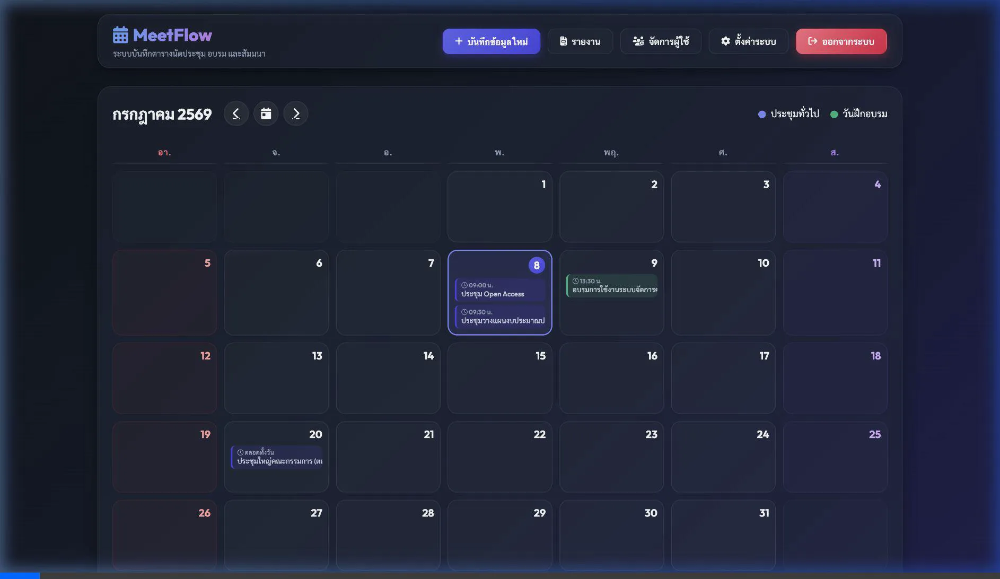
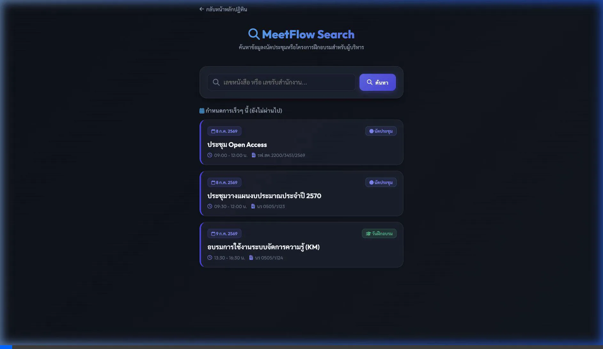
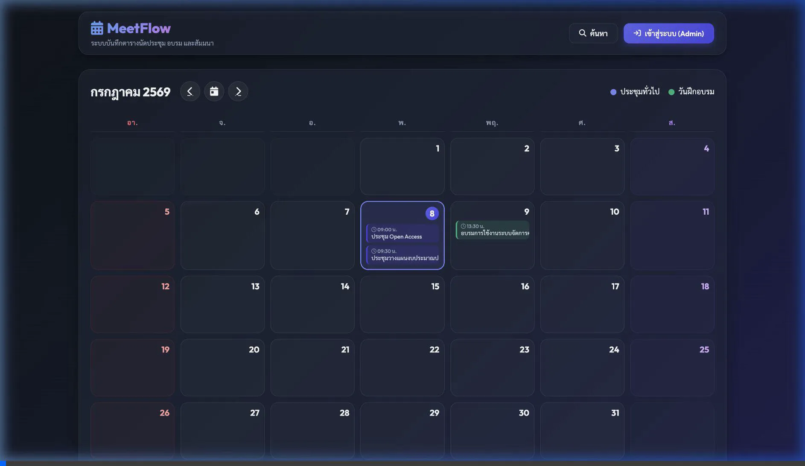

# คู่มือการใช้งานระบบ MeetFlow (สำหรับผู้ใช้งานทั่วไป)

ยินดีต้อนรับเข้าสู่คู่มือการใช้งานระบบ **MeetFlow** ระบบปฏิทินนัดประชุมและวันฝึกอบรมสำหรับผู้บริหาร คู่มือฉบับนี้จัดทำขึ้นเพื่อแนะนำวิธีการเข้าดูข้อมูลปฏิทินการนัดหมาย วิธีการค้นหาเอกสาร/หนังสือรับ และวิธีการคัดลอกลิงก์การประชุมออนไลน์เพื่อเตรียมตัวเข้าร่วมประชุมได้อย่างสะดวกและรวดเร็ว

---

## 📅 1. การดูข้อมูลการนัดหมายผ่านหน้าปฏิทิน (Calendar View)

หน้าหลักของระบบจะเป็นหน้าปฏิทินแบบรายเดือน ซึ่งจะแสดงรายการนัดประชุมและโครงการอบรมทั้งหมดที่มีการบันทึกไว้ในระบบ

### 💡 ขั้นตอนการดูข้อมูล:
1. **ดูภาพรวมปฏิทิน**: 
   * เมื่อเข้าสู่หน้าหลักของระบบ คุณจะเห็นปฏิทินแสดงนัดหมายรายเดือน
   * ป้ายชื่อการนัดหมายจะแบ่งแยกประเภทด้วยสีอย่างชัดเจน:
     * **👥 ป้ายสีน้ำเงิน**: รายการนัดหมายประชุมทั่วไป
     * **🏫 ป้ายสีเขียว**: โครงการหรือกำหนดการฝึกอบรม
     * **💜 ป้ายวันเสาร์ / ❤️ ป้ายวันอาทิตย์**: แถบปฏิทินประจำวันหยุดสุดสัปดาห์จะได้รับการไฮไลต์สีสันเป็นพิเศษเพื่อให้สังเกตได้ง่ายขึ้น
2. **เปิดดูรายละเอียด**:
   * คลิกที่แถบป้ายรายการนัดหมายที่คุณสนใจบนปฏิทิน เพื่อเปิดหน้าต่างรายละเอียดการนัดหมาย (Details Modal)
   * ในหน้าต่างนี้จะแสดงรายละเอียดที่จำเป็นทั้งหมด เช่น:
     * หัวข้อการประชุม / รายละเอียดเพิ่มเติม
     * วันและเวลา (หากเป็นเวลาราชการปกติที่ไม่มีเวลาสิ้นสุดระบุไว้ ระบบจะระบุเป็น **"ตลอดทั้งวัน"** หรือช่วงเวลา 08:30 - 16:30 น. โดยอัตโนมัติ)
     * เลขที่หนังสือส่ง / เลขรับสำนักงาน
     * รายชื่อผู้เข้าร่วมการนัดหมาย
     * ไฟล์แนบประกอบ (สามารถคลิกเพื่อเปิดอ่านหรือดาวน์โหลดได้ทันที)
     * ลิงก์ช่องทางประชุมออนไลน์ (Google Meet, MS Teams, Zoom ฯลฯ)

### 🎬 ภาพเคลื่อนไหวประกอบการใช้งานหน้าปฏิทิน:

---

## 🔍 2. การค้นหาข้อมูลนัดหมายและหนังสือรับ (Search & LINE LIFF)

สำหรับผู้ใช้งานบนโทรศัพท์มือถือ หรือผู้ที่เปิดผ่านแอปพลิเคชัน LINE หน้าค้นหานี้ได้รับการพัฒนาขึ้นมาในรูปแบบ **Mobile-First (LINE LIFF)** เพื่อให้อ่านง่าย ค้นหาสะดวกรวดเร็ว

### 💡 ขั้นตอนการใช้งาน:
1. **ดูรายการกำหนดการล่าสุด (Upcoming Events)**:
   * เมื่อคุณเปิดหน้าค้นหาเข้ามาโดยยังไม่ได้พิมพ์คำค้นหาใดๆ ระบบจะดึงข้อมูลรายการนัดหมายที่กำลังจะเกิดขึ้นเร็วๆ นี้ขึ้นมาแสดงให้คุณดูโดยอัตโนมัติ โดยเรียงจากรายการที่จะถึงเร็วที่สุดก่อน
2. **การแบ่งกลุ่มข้อมูลที่ชัดเจน**:
   * รายการกำหนดการทั้งหมดจะถูกแยกหมวดหมู่และจัดกลุ่มตามช่วงเวลาโดยอัตโนมัติ ได้แก่:
     * **วันนี้**: นัดหมายในวันนี้
     * **สัปดาห์นี้**: นัดหมายภายในสัปดาห์ปัจจุบัน
     * **เดือนนี้**: นัดหมายถัดไปในเดือนปัจจุบัน
     * **เดือนถัดๆ ไป**: นัดหมายในอนาคตระยะยาว
     * **ผ่านไปแล้ว**: รายการนัดหมายในอดีต (ป้ายจะแสดงด้วย**สีขุ่นจางลง**เพื่อบอกสถานะอย่างชัดเจน)
3. **การค้นหาข้อมูล**:
   * พิมพ์ข้อมูลที่คุณต้องการค้นหาในช่องค้นหาด้านบน เช่น **เลขที่หนังสือ** (เช่น `0505`) หรือ**เลขรับสำนักงาน** จากนั้นกดปุ่ม **"ค้นหา"**
   * ระบบจะแสดงรายการเอกสารนัดหมายทั้งหมดที่ตรงกับเงื่อนไขทันที
4. **การเปิด-ปิดการ์ดรายละเอียด**:
   * คุณสามารถกดแตะที่การ์ดนัดหมายใดๆ เพื่อขยาย (Expand) ดูรายละเอียดเนื้อหาภายใน รายชื่อผู้เข้าร่วมประชุม หรือลิงก์การประชุมออนไลน์ และสามารถแตะอีกครั้งเพื่อย่อเก็บได้

### 🎬 ภาพเคลื่อนไหวประกอบการค้นหาข้อมูล:

---

## 🔗 3. การใช้งานลิงก์เข้าประชุมออนไลน์และการคัดลอก (Copy Link)

หากการนัดหมายนั้นๆ มีการประชุมออนไลน์ประกอบอยู่ด้วย ระบบจะอำนวยความสะดวกโดยการแสดงลิงก์เต็มรูปแบบขึ้นมาบนหน้าจอ พร้อมปุ่มลัดสำหรับคัดลอกเพื่อความรวดเร็ว

### 💡 ขั้นตอนการคัดลอกและเข้าประชุม:
1. **กดเพื่อเข้าประชุมโดยตรง**:
   * คุณสามารถกดคลิกที่ชื่อลิงก์สีฟ้า หรือกดปุ่มสีน้ำเงิน **"เข้าประชุมออนไลน์"** เพื่อเปิดเบราว์เซอร์หรือแอปพลิเคชันห้องประชุมเข้าร่วมได้ทันที
2. **การคัดลอกลิงก์ (Copy to Clipboard)**:
   * กรณีต้องการส่งต่อลิงก์ห้องประชุมให้ผู้อื่น หรือเปิดในอุปกรณ์อื่น ให้คุณกดปุ่ม **"คัดลอก"** ด้านข้างตัวลิงก์
   * ปุ่มจะเปลี่ยนสถานะเป็นสัญลักษณ์เครื่องหมายถูกสีเขียวพร้อมข้อความ **"คัดลอกแล้ว"** แสดงว่าลิงก์ได้ถูกเก็บลงในระบบของคุณเรียบร้อยแล้ว สามารถนำไปกดวาง (Paste) ส่งต่อได้ทันที

### 🎬 ภาพเคลื่อนไหวประกอบการใช้งานปุ่มคัดลอกลิงก์:

